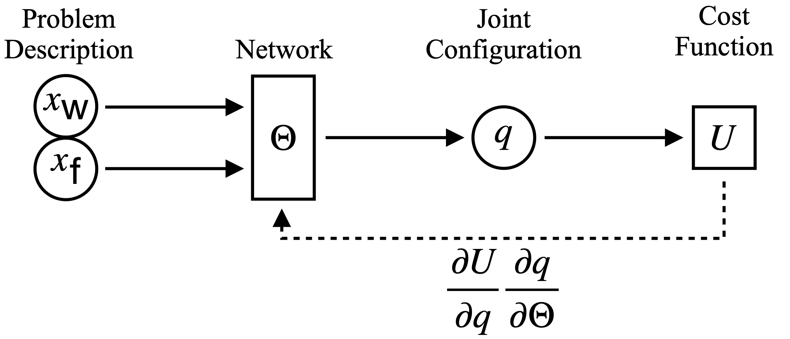
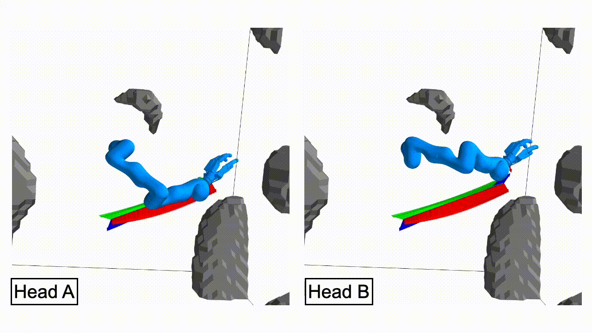
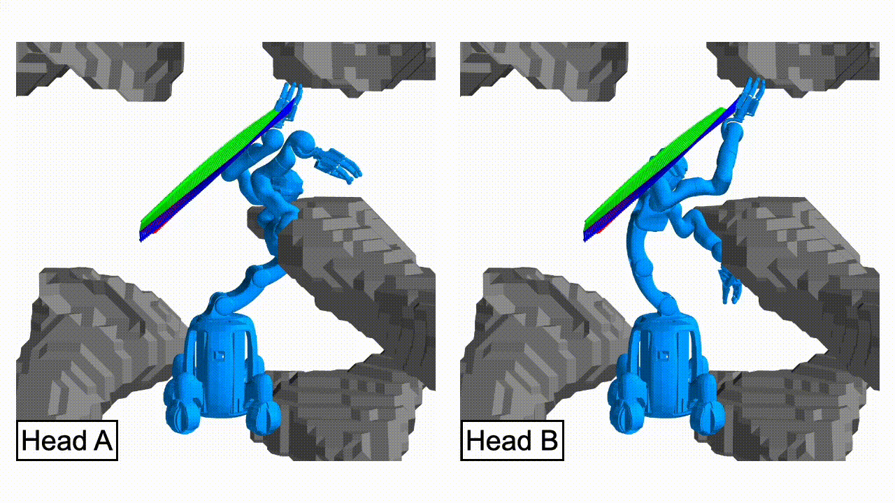

## Unsupervisd Regression
{:.this
    style="width: 600px;
    display: block;
    margin-left: auto;
    margin-right: auto"}
*Information flow through the neural network.
The IK problem is described by a world \\( x_{\text{w}} \\), and a frame in the workspace \\(x_{\text{f}}\\) and the network should predict a collision-free joint configuration \\(q\\) that satisfies the end-effector.
The dotted line indicates the backpropagation during unsupervised training, where the network weights \\(\Theta\\) are directly updated according to the gradient of the cost function \\(U\\).*

## Twin Heads
{:.this
    style="width: 600px;
    display: block;
    margin-left: auto;
    margin-right: auto"}
*Comparison between a single-headed network (left) and a twin-headed network (right) for the IK prediction.
There are points in the workspace where the network needs to switch modes, to reach all possible targets.
The underlying red heat map indicates the worst orientation error across all \\(2\pi\\) possible (discretized with 2880) orientations at each position.
This switch happens not instantaneously but over a small range, which the dark red circle highlights.
Each head of the twin model also has switching points, but as those two regions do not intersect, it can always predict valid and smoothly changing configurations.
See also the accompanying video for a clearer visualization of the mode switch.*

{:.this
    style="width: 600px;
    display: block;
    margin-left: auto;
    margin-right: auto"}

{:.this
    style="width: 600px;
    display: block;
    margin-left: auto;
    margin-right: auto"}

## Boosting
TODO Show prior/after effct of boosting.
Ask Arman if he has a suitable figure for this

By using a general rejection sampling approach and using the flexibility of the pan-tilt joints of the robots neck we were able to
collect a large dataset of different robot configurations quickly.

{:.this
style="width: 600px;
display: block;
margin-left: auto;
margin-right: auto"}
*The different marker positions in the image for the left arm, the pole on the floor and the right arm.
We move the pan-tilt joints of the robot's neck to get a good coverage of the image over all markers.*

## Virtual Noise

{:.this
style="width: 600px;
display: block;
margin-left: auto;
margin-right: auto"}
*Probabilistic graphical model of the calibration problem including the camera and robot model.
For each of the \\(N\\) samples, it describes how the pixel coordinates \\(u\\) of a marker is computed from the joint configuration \\(q\\) and the model parameters \\(\Theta\\).
**Left (w/o red parts)**: Original mapping with the real pixel measurement noise \\(\eta_u\\) as the only source of stochasticity.
**Right**: An additional virtual cartesian noise node is added to compensate for the imperfect (actually deterministic) kinematic model.
**Left (with red parts)**: The virtual noise can be incorporated into the original model, resulting in an effective pixel noise with a \\(\tilde{\sigma}_u\\) depending on the distance of the marker to the camera (\\(\propto 1/z^2\\)).*

---

