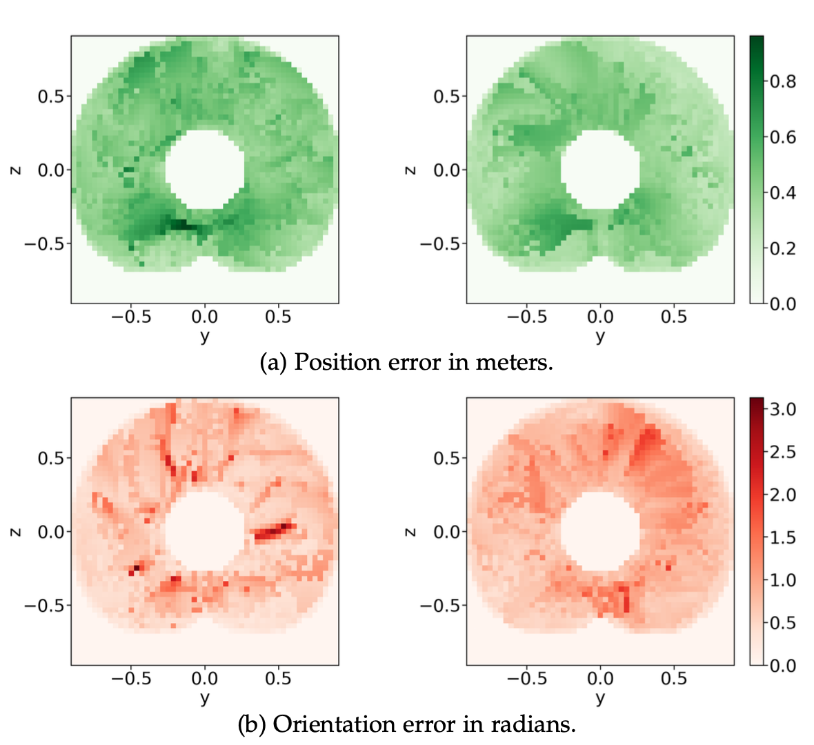

## Unsupervisd Regression
{:.this
    style="width: 600px;
    display: block;
    margin-left: auto;
    margin-right: auto"}
*Information flow through the neural network.
The IK problem is described by a world \\( x_{\text{w}} \\), and a frame in the workspace \\(x_{\text{f}}\\) and the network should predict a collision-free joint configuration \\(q\\) that satisfies the end-effector.
The dotted line indicates the backpropagation during unsupervised training, where the network weights \\(\Theta\\) are directly updated according to the gradient of the cost function \\(U\\).*

---
## Joint Representation 
{:.this
    style="width: 600px;
    display: block;
    margin-left: auto;
    margin-right: auto"}
*Comparison between a model that represents joint angles using radians (left) and one that represents them as points on the unit circle (right). 
At each position, the plots show the maximum error for Flat Arm over 2880 evenly spaced target orientations.*
---

## Twin Heads
{:.this
    style="width: 600px;
    display: block;
    margin-left: auto;
    margin-right: auto"}
*Comparison between a single-headed network (left) and a twin-headed network (right) for the IK prediction.
There are points in the workspace where the network needs to switch modes, to reach all possible targets.
The underlying red heat map indicates the worst orientation error across all \\(2\pi\\) possible (discretized with 2880) orientations at each position.
This switch happens not instantaneously but over a small range, which the dark red circle highlights.
Each head of the twin model also has switching points, but as those two regions do not intersect, it can always predict valid and smoothly changing configurations.
See also the accompanying video for a clearer visualization of the mode switch.*

{:.this
    style="width: 600px;
    display: block;
    margin-left: auto;
    margin-right: auto"}

{:.this
    style="width: 600px;
    display: block;
    margin-left: auto;
    margin-right: auto"}

--- 

## Boosting
{:.this
    style="width: 600px;
    display: block;
    margin-left: auto;
    margin-right: auto"}
*Comparison between a model without boosting (left) and one with boosting (right) on LWR III without obstacles. 
These plots show the maximum error over all target orientations at each position. 
The plots show a slice of the workspace at x = 0.*

